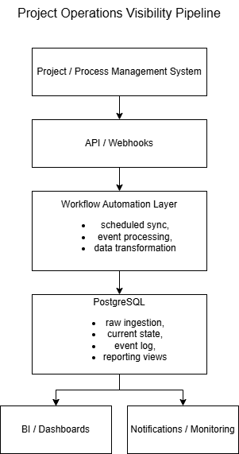

# Project Operations Visibility Pipeline

A portfolio-safe case study of an internal workflow automation and reporting pipeline built to improve process visibility, reduce manual reporting effort, and support data-driven operational decisions.

> Note: this repository is intentionally anonymized and simplified due to NDA restrictions. It focuses on architecture, data flow, and engineering decisions rather than proprietary implementation details.

## Overview

This project represents a workflow-driven integration pipeline designed to collect project/process data from an operational system, structure it in PostgreSQL, and prepare it for reporting, analytics, and process notifications.

The solution is centered around:
- workflow automation
- API/webhook-based integrations
- relational data modeling
- idempotent ingestion
- event logging and versioning
- BI-ready reporting structures

## Problem

Operational data often lives inside project management or process tools in a form that is difficult to analyze consistently. Reporting becomes manual, historical changes are hard to trace, and stakeholders lack timely visibility into delays, status changes, and planning shifts.

## Solution

The pipeline ingests project/process events and entity snapshots from an operational source, normalizes them, stores them in PostgreSQL, and prepares structured views for reporting dashboards and internal notifications.

### Core capabilities
- ingesting data via API/webhooks
- storing current and historical records
- logging operational events
- applying deduplication and upsert logic
- preparing BI-friendly reporting views
- supporting downstream notifications and monitoring

## Architecture

Operational System  
→ API / Webhooks  
→ Workflow Automation Layer  
→ PostgreSQL (raw + current + event log + reporting views)  
→ BI / Dashboards / Notifications

## My role

I designed the data flow, ingestion logic, and reporting structure, including:
- workflow automation design
- data mapping and transformation
- relational data modeling
- event logging strategy
- deduplication / idempotency approach
- reporting-oriented database structures
- preparation for notifications and operational visibility

## Key engineering decisions

### Idempotent ingestion
Repeated runs should not create duplicates or corrupt state.  
To support this, the pipeline uses:
- deduplication keys
- upsert logic
- controlled update rules
- event-based tracking for changes

### Historical visibility
Instead of relying only on current-state records, the solution keeps an event/log layer and version-aware structures so reporting can show how and why a process changed over time.

### Reporting-first modeling
The database is not only a storage target; it is modeled to support practical reporting, operational metrics, and stakeholder visibility.

## Example use cases

- identify overdue work items
- compare current state vs. baseline/planned state
- detect status changes over time
- support management dashboards
- prepare process-specific notifications
- reduce manual reporting effort

## Example stack

- workflow automation: n8n
- integrations: REST APIs / webhooks
- database: PostgreSQL
- scripting / logic: JavaScript, Python
- deployment: Docker
- analytics: BI dashboards / reporting views

## Portfolio note

This repository is a sanitized case study created to demonstrate:
- workflow automation thinking
- systems integration design
- data modeling for internal tools
- reporting pipeline architecture
- practical engineering decisions under real operational constraints

## Future improvements

- notification rules engine
- service health monitoring
- retry / failure tracking
- configurable process rules
- AI-assisted reporting summaries
